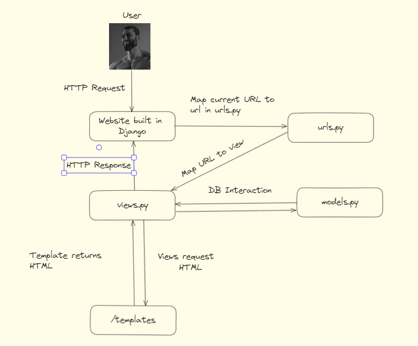

# Tugas 2 PBP

### Muttaqin Muzakkir, 2306207101

### PWS

Link: http://muttaqin-muzakkir-ecommerce.pbp.cs.ui.ac.id

## Jelaskan bagaimana cara kamu mengimplementasikan checklist di atas secara step-by-step (bukan hanya sekadar mengikuti tutorial).

#### Membuat sebuah proyek Django baru.

**Install Django** (jika belum terinstal):

```bash
pip install django
```

**Start Project**:
```bash
    django-admin startproject ecommerce
    cd ecommerce
```

**Run Project**:
```bash
    python3 manage.py runserver
```

#### Membuat aplikasi dengan nama `main` pada proyek tersebut.

Aplikasi pada Django adalah semacam _module_ pada Django yang berbasis MVT. Untuk membuat app pada Django, ada commandnya.
**Membuat Django App**:
`bash
    django-admin startapp main
    `

#### Melakukan routing pada proyek agar dapat menjalankan aplikasi main.

1. Setelah menambah apps, kita harus menambahkannya ke `INSTALLED_APPS` di `settings.py`.
2. Menginisiasi sebuah `urls.py` pada folder `/ecommerce` dan mengisikannya dengan isian `/ecommerce/views.py` yang akan nanti kita buat.
3. Menambah urls baru pada project kita dengan mengkonfigurasi `/ecommerce/urls.py` untuk _map_ ke `urls.py` utama.

```python
from django.contrib import admin
from django.urls import path, include

urlpatterns = [
    path('admin/', admin.site.urls),
    path('', include('main.urls')),
]
```

#### Membuat model pada aplikasi main dengan nama Product dan memiliki atribut wajib.
Buat file `models.py` di dalam folder `main` dan sesuaikan dengan aplikasi. Dalam aplikasi kami, ini adalah isi models.py kami,
```python
from django.db import models


class Product(models.Model):
    # Atribut Wajib
    name = models.CharField(max_length=255)  # Nama item
    price = models.IntegerField()  # Harga item
    description = models.TextField()  # Deskripsi item

    # Atribut Tambahan
    stock = models.PositiveIntegerField(default=0)  # Jumlah stok
    category = models.CharField(max_length=100, blank=True, null=True)  # Kategori item
    imageSrc = models.CharField(max_length=256)  # Gambar item
    rating = models.PositiveIntegerField(default=0)  # Rating item

    def __str__(self):
        return self.name

    class Meta:
        verbose_name = "Product"
        verbose_name_plural = "Products"
```

#### Membuat sebuah fungsi pada `views.py` untuk dikembalikan ke dalam sebuah template HTML yang menampilkan nama aplikasi serta nama dan kelas kamu.
Untuk file views.py di dalam folder main, kita mesti menginisiasi sebuah function yang menerima *request* dan render dengan *context* dan requestnya:
```python
from django.shortcuts import render


# Create your views here.
def index(req):
    ctx = [
        {
            "name": "Classic Leather Jacket",
            ...ctx
        }
    ]

    return render(req, "main.html", {"products": ctx})

```

Lalu, dari sini kita membuat file html untuk menampung context kita.

#### Membuat routing pada urls.py aplikasi main untuk memetakan fungsi yang telah dibuat pada views.py.
Untuk meng-map urls di main ke aplikasi Django, mesti kita isi dulu file `main/urls.py`.
```python
# main/urls.py
from django.urls import path
from .views import index

urlpatterns = [
    path('', index, name='index'),
]
```

#### Melakukan deployment ke PWS terhadap aplikasi yang sudah dibuat sehingga nantinya dapat diakses oleh teman-temanmu melalui Internet.
Deployment ke PWS dapat dilakukan dengan membuat proyek baru di PWS dan mengikuti langkah-langkah di webnya. Setelah itu, silahkan menambahkan URL PWS ke `ALLOWED_HOSTS`, dan jangan lupa untuk selalu push perubahan terbaru ke PWS.

## Buatlah bagan yang berisi request client ke web aplikasi berbasis Django beserta responnya dan jelaskan pada bagan tersebut kaitan antara urls.py, views.py, models.py, dan berkas html.


## Jelaskan fungsi git dalam pengembangan perangkat lunak!
Git adalah sistem kontrol versi yang memungkinkan pengembang untuk melacak perubahan dalam kode sumber, bekerja secara bersamaan dalam proyek, dan mengelola versi berbagai revisi dari kode. Dengan Git, pengembang dapat:

#### Menyimpan Versi
Menyimpan snapshot dari kode pada berbagai titik waktu.
#### Kolaborasi
Bekerja dengan tim tanpa konflik, menggunakan fitur seperti branch dan merge.
#### Rollback
Kembali ke versi sebelumnya jika terjadi masalah.
#### Branching
Membuat cabang untuk fitur baru tanpa memengaruhi kode utama.

## Menurut Anda, dari semua framework yang ada, mengapa framework Django dijadikan permulaan pembelajaran pengembangan perangkat lunak?
Menurut saya, Django adalah pilihan yang tepat untuk pemula programmer di Fasilkom. Ini karena alasan-alasan berikut:

1. **Penggunaan Python**: Django adalah framework web di `Python`, di mana mahasiswa Fasilkom sudah terbiasa dengan Python dari DDP1. Bahasa lain yang sudah biasa dengan mahasiswa Fasilkom adalah `Java`, namun framework popular seperti `Springboot` di `Java` mungkin tidak se-*beginner-friendly* Django.
 
1. **Fitur Lengkap dan Terintegrasi**: Django menyediakan banyak fitur bawaan seperti sistem admin, ORM (Object-Relational Mapping), routing URL, dan validasi form. Ini memungkinkan pengembang untuk fokus pada logika bisnis tanpa harus mengkonfigurasi banyak hal dari awal.

2. **Dokumentasi yang Komprehensif**: Django memiliki dokumentasi yang sangat baik dan terperinci, memudahkan pemula untuk memahami konsep-konsep dasar dan mengikuti tutorial.

3. **Keamanan**: Django memiliki banyak fitur keamanan built-in yang membantu melindungi aplikasi dari berbagai kerentanan seperti SQL injection, cross-site scripting (XSS), dan cross-site request forgery (CSRF).

4. **Konvensi dan Standar**: Django mengikuti prinsip-prinsip "konvensi di atas konfigurasi", yang memudahkan pemula untuk mengikuti praktik terbaik tanpa harus membuat banyak keputusan desain.

5. **Komunitas Aktif**: Django memiliki komunitas yang besar dan aktif, menyediakan banyak sumber daya tambahan, seperti forum, grup diskusi, dan plugin.

6. **Pemrograman Berbasis MVT (Model-View-Template)**: Struktur MVT yang diterapkan oleh Django membantu memisahkan logika bisnis, antarmuka pengguna, dan pengolahan data, membuat pengembangan lebih terorganisir.

## Mengapa model pada Django disebut sebagai ORM?
Sebelum itu, mari kita artikan terlebih dahulu apa artinya *ORM*.
#### Object Relational Mapping (ORM)
**ORM** adalah teknik pemrograman yang digunakan untuk menghubungkan database relasional dengan aplikasi berbasis objek. ORM memungkinkan pengembang untuk berinteraksi dengan database menggunakan objek dan kelas dalam bahasa pemrograman, alih-alih menggunakan query SQL langsung. Contoh dari ORM adalah Prisma pada aplikasi berbasis Javascript dan GORM pada aplikasi Golang.

Di Django, model disebut sebagai ORM karena:

1. **Abstraksi Database**: ORM Django memungkinkan pengembang untuk berinteraksi dengan database melalui objek Python, tanpa perlu menulis query SQL secara manual. Ini membuat pengembangan lebih mudah dan lebih bersih.

2. **Mapping**: Model Django memetakan kelas Python ke tabel database dan atribut kelas ke kolom tabel. Ini menciptakan hubungan langsung antara struktur data aplikasi dan database.

3. **Querying yang Mudah**: ORM menyediakan API yang mudah digunakan untuk melakukan query pada database. Pengembang dapat menggunakan metode Python untuk membuat, membaca, memperbarui, dan menghapus data.

4. **Konsistensi**: Dengan menggunakan ORM, pengembang dapat menjaga konsistensi antara objek aplikasi dan struktur database, mengurangi kemungkinan kesalahan dan inkonsistensi data.

ORM di Django menyederhanakan proses interaksi dengan database dan meningkatkan produktivitas pengembangan perangkat lunak dengan menghilangkan kebutuhan untuk menulis SQL secara langsung.

# Tugas 2 PBP A
## Muttaqin Muzakkir
## 2306207101