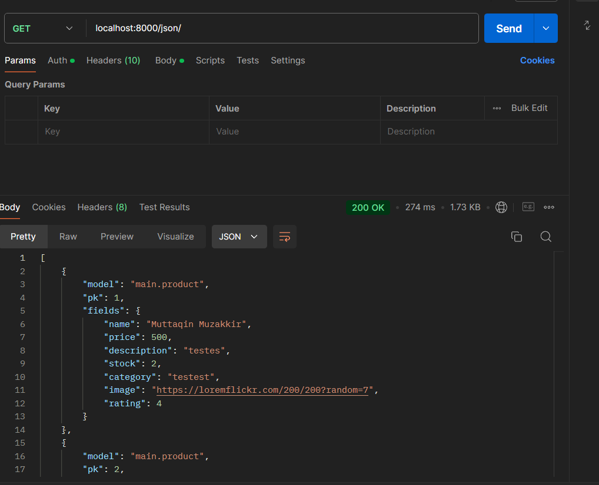
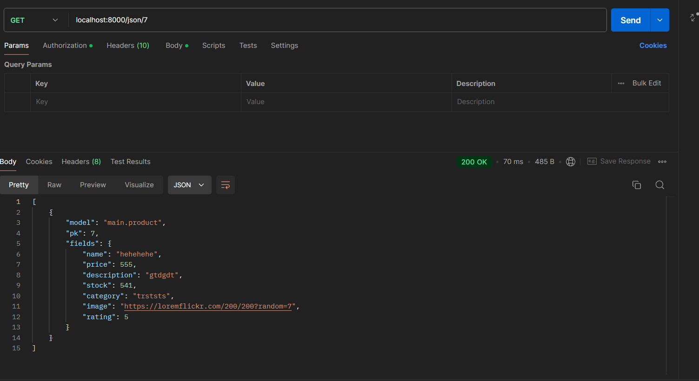
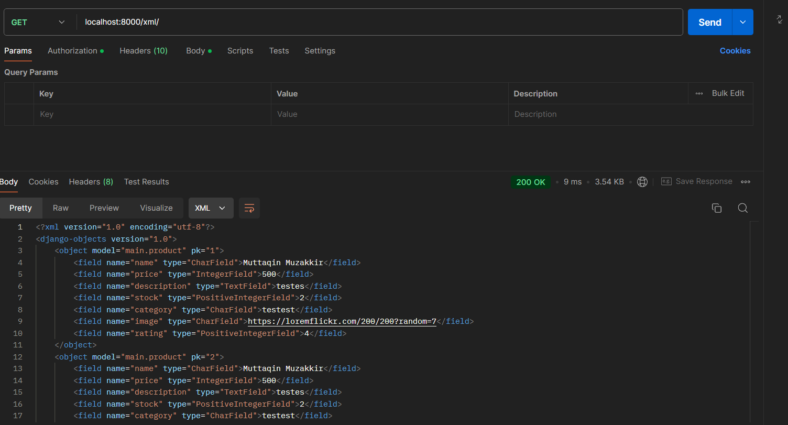
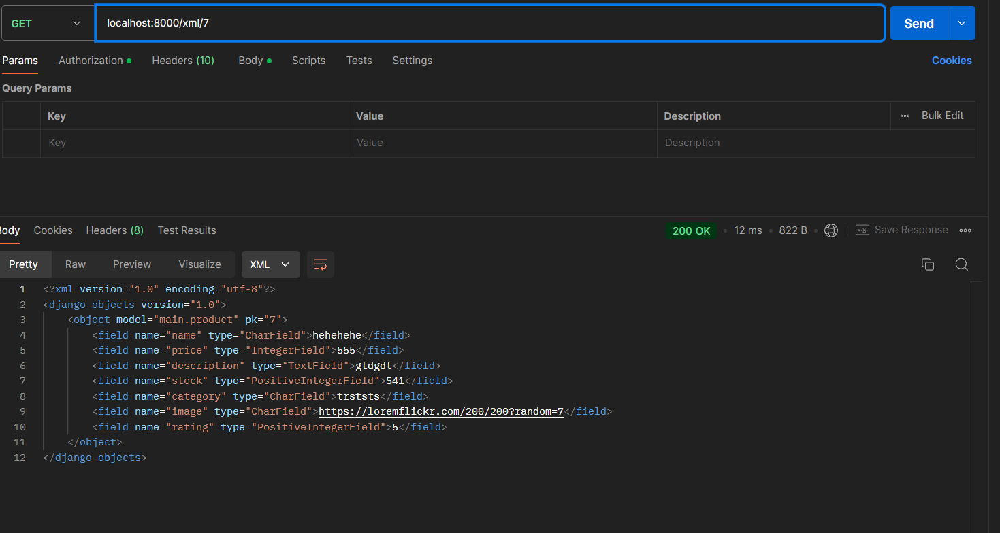
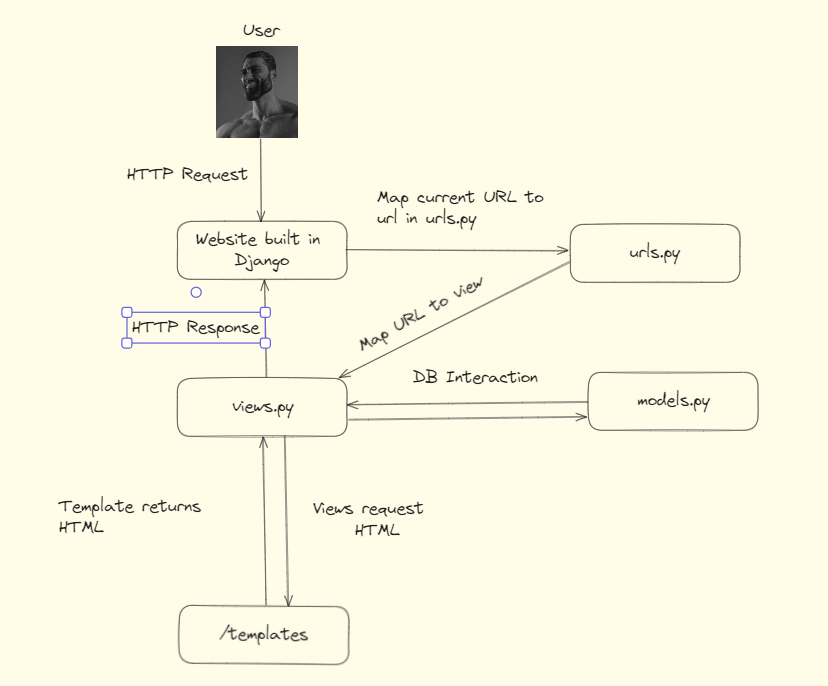

### Muttaqin Muzakkir, 2306207101
### PWS: https://muttaqin-muzakkir-ecommerce.pbp.cs.ui.ac.id

# Tugas 5 PBP

## Implementasi Checklist
## 1. Fungsi untuk Menghapus dan Mengedit Product

### Konsep yang Diterapkan:
- **CRUD (Create, Read, Update, Delete)**: Implementasi fungsi untuk menghapus dan mengedit produk merupakan bagian dari operasi dasar dalam aplikasi yang berfokus pada pengelolaan data.

### Langkah-Langkah yang Dilalui:
1. **Membuat Views**:
   - Buat view untuk menampilkan form pengeditan produk. View ini akan mengambil data produk dari database dan mempersiapkan form dengan data yang sudah ada.
   - Buat view terpisah untuk menangani penghapusan produk, yang akan menghapus produk berdasarkan ID.

2. **Memetakan ke URL**:
   - Definisikan URL untuk mengakses fungsi edit dan hapus produk. Setiap URL akan dihubungkan dengan view yang relevan.

3. **Menangani Data dari Form**:
   - Pada saat form pengeditan disubmit, ambil data dari form dan update informasi produk di database. Untuk penghapusan, cukup lakukan penghapusan berdasarkan ID yang diberikan.

## 2. Kustomisasi Desain Template HTML

### Konsep yang Diterapkan:
- **Desain Responsif**: Penting untuk memastikan bahwa antarmuka pengguna dapat menyesuaikan diri dengan berbagai ukuran layar.
- **Penggunaan CSS Framework**: Memanfaatkan framework CSS seperti Tailwind CSS untuk mempercepat proses styling dan memberikan tampilan yang menarik.

### Langkah-Langkah yang Dilalui:
1. **Kustomisasi Halaman Login dan Register**:
   - Rancang ulang halaman login dan register untuk membuatnya lebih menarik dengan mempertimbangkan penggunaan warna, tipografi, dan layout yang nyaman dilihat.

2. **Kustomisasi Halaman Daftar Product**:
   - Tentukan logika untuk menampilkan pesan yang sesuai ketika tidak ada produk yang terdaftar. Pastikan halaman memberikan pengalaman pengguna yang baik dengan gambar dan teks yang informatif.
   - Jika ada produk yang terdaftar, gunakan card untuk menampilkan detail produk. Setiap card akan mencakup informasi penting dan tombol untuk mengedit atau menghapus produk.

## 3. Navbar yang Responsif

### Konsep yang Diterapkan:
- **Navigasi Responsif**: Menerapkan desain yang responsif sehingga pengguna di perangkat mobile dan desktop dapat dengan mudah menavigasi aplikasi.
- **Penggunaan Flexbox dan Media Queries**: Menggunakan flexbox untuk mengatur elemen dalam navbar secara horizontal dan menggunakan media queries untuk mengubah tampilan navbar berdasarkan ukuran layar.

### Langkah-Langkah yang Dilalui:
1. **Membuat Struktur Navbar**:
   - Rancang struktur dasar navbar dengan mempertimbangkan elemen-elemen seperti logo, tautan navigasi, dan tombol untuk membuka menu di perangkat mobile.

2. **Styling Navbar**:
   - Terapkan gaya CSS untuk memberikan tampilan yang menarik pada navbar. Gunakan flexbox untuk mengatur elemen-elemen dalam navbar agar terlihat rapi dan teratur.

3. **Menambahkan Fungsionalitas Menu Mobile**:
   - Implementasikan logika JavaScript untuk mengatur interaksi pada navbar mobile. Ketika tombol hamburger diklik, tampilkan atau sembunyikan menu.

## Subquestions
## 1. Urutan Prioritas CSS Selector

Ketika ada beberapa CSS selector yang berlaku untuk suatu elemen HTML, urutan prioritas pengambilan CSS selector ditentukan oleh konsep yang disebut *Specificity*. Berikut adalah urutannya dari yang paling tinggi hingga yang terendah:

1. **Inline Styles**: Gaya yang ditulis langsung pada atribut `style` dalam elemen HTML, contohnya: `<div style="color: red;">`.
2. **IDs**: Selector dengan ID, ditandai dengan tanda `#`, contohnya: `#header`.
3. **Classes, Pseudo-classes, dan Attributes**: Selector yang menggunakan kelas (.), pseudo-kelas (:hover, :focus), dan atribut (div[title]).
4. **Elements (Tag)**: Selector berdasarkan nama elemen HTML, contohnya: `div`, `p`, `h1`.

Jika terdapat beberapa selector yang memiliki tingkat spesifikasi yang sama, urutan pengambilan akan mengikuti urutan deklarasi dalam CSS, di mana yang terakhir dideklarasikan akan diprioritaskan.

## 2. Pentingnya Responsive Design

Responsive design menjadi konsep penting dalam pengembangan aplikasi web karena:

- **Pengalaman Pengguna**: Dengan adanya responsive design, aplikasi web dapat memberikan pengalaman yang konsisten di berbagai perangkat (desktop, tablet, smartphone).
- **SEO**: Google lebih menyukai website yang responsif, sehingga dapat meningkatkan peringkat pencarian.
- **Biaya Pemeliharaan**: Menggunakan responsive design dapat mengurangi kebutuhan untuk membuat beberapa versi situs web untuk perangkat yang berbeda.

### Contoh Aplikasi
- **Aplikasi yang Sudah Menerapkan Responsive Design**: Website e-commerce seperti Amazon dan Zalando, yang menyesuaikan tata letak dan konten sesuai ukuran layar.
- **Aplikasi yang Belum Menerapkan Responsive Design**: Beberapa blog lama atau situs web statis yang hanya dirancang untuk desktop, sehingga tampak tidak teratur ketika diakses melalui perangkat mobile.

## 3. Margin, Border, dan Padding

- **Margin**: Ruang di luar elemen yang memisahkannya dari elemen lain. Dapat diatur menggunakan properti `margin`. Contoh: `margin: 10px;`.
  
- **Border**: Garis yang mengelilingi elemen, berfungsi sebagai batas. Diatur dengan properti `border`. Contoh: `border: 1px solid black;`.
  
- **Padding**: Ruang di dalam elemen, antara konten dan batas elemen. Diatur menggunakan properti `padding`. Contoh: `padding: 10px;`.

### Implementasi
Untuk mengimplementasikan ketiga hal tersebut, kita bisa menggunakan CSS sebagai berikut:

```css
.element {
    margin: 10px;       /* Mengatur jarak luar */
    border: 1px solid black; /* Mengatur batas */
    padding: 10px;      /* Mengatur jarak dalam */
}
```

## 4. Konsep Flex Box dan Grid Layout

### Flex Box
Flexbox adalah model layout CSS yang memungkinkan pengaturan elemen dalam satu dimensi (baris atau kolom). Elemen dapat diatur dengan fleksibel untuk mengisi ruang yang tersedia. Kegunaan flexbox antara lain:
- Mengatur alignment elemen.
- Mengelola ruang di antara elemen dengan lebih efisien.

### Grid Layout
Grid Layout adalah sistem layout dua dimensi yang memungkinkan penataan elemen dalam baris dan kolom. Kegunaan grid layout termasuk:
- Menciptakan tata letak yang lebih kompleks dan responsif.
- Menyediakan kontrol yang lebih besar terhadap ukuran dan posisi elemen.

Contoh implementasi:

```css
.container {
    display: flex; /* untuk flexbox */
}

.grid-container {
    display: grid; /* untuk grid layout */
    grid-template-columns: repeat(3, 1fr);
}
```

# Tugas 4 PBP
## 1. Mengimplementasikan Fungsi Registrasi, Login, dan Logout
Untuk memungkinkan pengguna mengakses aplikasi sebelumnya dengan lancar, kita perlu mengimplementasikan tiga fungsi utama:
- **Registrasi**: Membuat formulir untuk pendaftaran pengguna baru, menyimpan data pengguna di database, dan melakukan validasi.
- **Login**: Membuat formulir login yang memverifikasi kredensial pengguna dan memulai sesi.
- **Logout**: Menyediakan mekanisme untuk mengakhiri sesi pengguna dan menghapus informasi autentikasi.

## 2. Membuat Dua Akun Pengguna dengan Dummy Data
Untuk membuat dua akun pengguna dengan masing-masing tiga dummy data, kita dapat menggunakan metode berikut:
1. Menggunakan shell Django atau skrip migrasi untuk membuat pengguna baru.
2. Membuat tiga objek produk palsu untuk setiap akun dengan model `Product` yang telah dibuat sebelumnya.

## 3. Menghubungkan Model Product dengan User
Model `Product` dapat dihubungkan dengan `User` melalui ForeignKey. Misalnya:
```python
from django.db import models
from django.contrib.auth.models import User

class Product(models.Model):
    name = models.CharField(max_length=100)
    price = models.DecimalField(max_digits=10, decimal_places=2)
    user = models.ForeignKey(User, on_delete=models.CASCADE)
```
Ini akan memungkinkan kita untuk mengaitkan setiap produk dengan pengguna tertentu.

## 4. Menampilkan Detail Informasi Pengguna yang Sedang Logged In
Untuk menampilkan informasi pengguna yang sedang login, kita bisa menambahkan kode berikut di halaman utama:
```python
from django.contrib.auth.decorators import login_required

@login_required
def home(request):
    return render(request, 'home.html', {'username': request.user.username})
```
Untuk menerapkan cookies seperti `last_login`, kita bisa menambahkan cookie dalam fungsi view:
```python
response.set_cookie('last_login', request.user.last_login)
```

## 5. Pertanyaan di README.md

### 5.1 Apa perbedaan antara HttpResponseRedirect() dan redirect()?
- `HttpResponseRedirect()` adalah kelas yang digunakan untuk menghasilkan respon HTTP yang mengarahkan ke URL tertentu. Kita perlu menyebutkan URL secara manual.
- `redirect()` adalah fungsi yang lebih praktis karena secara otomatis menangani resolusi URL dan dapat menerima objek model, nama tampilan, dan lebih banyak argumen.

### 5.2 Jelaskan cara kerja penghubungan model Product dengan User!
Penghubungan dilakukan melalui penggunaan ForeignKey dalam model `Product`, yang menunjuk ke model `User`. Hal ini memungkinkan setiap produk untuk memiliki pemilik yang ditentukan, sehingga mempermudah pengelolaan produk berdasarkan pengguna.

### 5.3 Apa perbedaan antara authentication dan authorization, dan apa yang dilakukan saat pengguna login?
- **Authentication** adalah proses verifikasi identitas pengguna (misalnya, memeriksa username dan password).
- **Authorization** adalah proses penentuan apakah pengguna yang sudah terautentikasi memiliki izin untuk mengakses sumber daya tertentu.
Saat pengguna login, proses yang terjadi adalah autentikasi untuk memastikan identitas pengguna yang benar.

### 5.4 Bagaimana Django mengingat pengguna yang telah login?
Django mengingat pengguna yang telah login dengan menyimpan session ID di cookie browser pengguna. Saat pengguna mengunjungi kembali aplikasi, Django memeriksa cookie ini untuk mengidentifikasi sesi aktif.

### 5.5 Jelaskan kegunaan lain dari cookies dan apakah semua cookies aman digunakan?
Cookies dapat digunakan untuk menyimpan preferensi pengguna, informasi pelacakan, dan pengaturan situs. Tidak semua cookies aman, terutama yang tidak dienkripsi, karena dapat dieksploitasi untuk pencurian data atau serangan CSRF.

### 5.6 Jelaskan bagaimana cara kamu mengimplementasikan checklist di atas secara step-by-step
1. **Membuat Fungsi Autentikasi**: Membuat formulir dan logika untuk registrasi, login, dan logout.
2. **Membuat Dummy Data**: Menggunakan shell Django untuk membuat pengguna dan produk palsu.
3. **Menghubungkan Model**: Mengedit model `Product` untuk menyertakan ForeignKey ke model `User`.
4. **Menampilkan Informasi Pengguna**: Menggunakan dekorator `login_required` untuk membatasi akses dan menampilkan informasi pengguna di halaman utama.

# Tugas 3 PBP

## Mengapa Kita Memerlukan Data Delivery dalam Pengimplementasian Sebuah Platform?

Data delivery diperlukan dalam pengimplementasian sebuah platform untuk memastikan bahwa data yang diproses di backend dapat diakses oleh frontend atau sistem lain yang membutuhkannya. Data delivery memungkinkan komunikasi antara berbagai komponen aplikasi yang terpisah, seperti client-server, microservices, atau API. Tanpa mekanisme pengiriman data, aplikasi tidak akan dapat menampilkan data secara dinamis, mengolah input dari pengguna, atau menyediakan layanan yang responsif.

## Mana yang Lebih Baik antara XML dan JSON? Mengapa JSON Lebih Populer Dibandingkan XML?

Antara XML dan JSON, **JSON lebih baik dalam banyak situasi modern** karena lebih ringan, lebih mudah dibaca, dan lebih cepat diproses dibandingkan XML. JSON menggunakan lebih sedikit simbol dan struktur sederhana, yang membuatnya lebih efisien untuk data interaksi antara server dan client. Selain itu, JSON lebih terintegrasi dengan bahasa pemrograman seperti JavaScript, sehingga lebih cocok untuk aplikasi web modern.

JSON menjadi lebih populer karena:

1. **Lebih ringkas**: JSON membutuhkan lebih sedikit data overhead dibandingkan XML, membuat transfer data lebih efisien.
2. **Lebih mudah dibaca**: JSON lebih mudah dipahami dan diinterpretasi oleh pengembang.
3. **Integrasi yang baik dengan JavaScript**: JSON digunakan secara langsung dalam objek JavaScript, membuatnya sangat mudah diolah di browser.

Namun, XML masih memiliki kelebihan dalam hal struktur dokumen yang lebih kompleks dan ketika elemen metadata diperlukan (seperti atribut dalam tag XML).

## Fungsi dari Method `is_valid()` pada Form Django dan Mengapa Kita Membutuhkan Method Tersebut?

Method `is_valid()` pada form Django berfungsi untuk **memvalidasi input pengguna** yang diterima dari form. Ketika kita memanggil method ini, Django akan mengecek apakah data yang dimasukkan ke dalam form memenuhi semua aturan validasi yang telah ditetapkan di model atau form tersebut. Misalnya, Django akan memastikan bahwa field yang wajib diisi tidak kosong, format email sesuai, angka berada dalam rentang yang diperbolehkan, dan sebagainya.

Kita membutuhkan method ini agar aplikasi dapat menangani input yang benar dan memberikan umpan balik (feedback) kepada pengguna jika terdapat kesalahan, sehingga mencegah data yang tidak valid masuk ke dalam sistem.

## Mengapa Kita Membutuhkan `csrf_token` Saat Membuat Form di Django? Apa yang Dapat Terjadi Jika Kita Tidak Menambahkan `csrf_token` pada Form Django? Bagaimana Hal Tersebut Dapat Dimanfaatkan oleh Penyerang?

`csrf_token` digunakan untuk melindungi aplikasi dari **serangan CSRF (Cross-Site Request Forgery)**. CSRF adalah jenis serangan di mana seorang penyerang membuat pengguna yang terautentikasi di sebuah aplikasi melakukan aksi yang tidak diinginkan tanpa sepengetahuan mereka. Dengan menambahkan `csrf_token`, kita memberikan token unik yang harus dikirim bersama setiap request form yang diajukan. Ini memastikan bahwa request tersebut benar-benar datang dari pengguna yang sah dan bukan dari penyerang.

Jika kita tidak menambahkan `csrf_token`, aplikasi akan rentan terhadap serangan CSRF, di mana penyerang dapat mengirimkan request yang tampak sah (misalnya, untuk mengubah data penting atau mengirimkan form) dari browser korban tanpa izin mereka.

Penyerang dapat memanfaatkan kelemahan ini dengan mengarahkan pengguna untuk mengunjungi situs yang berisi script jahat, yang kemudian mengirimkan request ke aplikasi tanpa sepengetahuan pengguna. Ini dapat mengakibatkan perubahan data yang tidak sah atau pelanggaran keamanan lainnya.

## Implementasi Checklist Secara Step-by-Step

1. **Membuat Model Product**:

   - Membuat model `Product` di `models.py` dengan atribut seperti `name`, `price`, `description`, `stock`, `category`, `image`, dan `rating`.

2. **Membuat Form Product**:

   - Membuat `ProductForm` di `forms.py` menggunakan Django's `ModelForm` untuk memudahkan pengelolaan form berdasarkan model `Product`.

3. **Membuat Views untuk Menampilkan dan Menambahkan Data**:

   - Membuat view `create_product` untuk menampilkan form dan menyimpan data produk baru ke database setelah validasi.
   - Menambahkan views untuk menampilkan data dalam format XML dan JSON, baik untuk semua produk maupun berdasarkan ID.

4. **Membuat Routing URL**:

   - Menambahkan routing URL di `urls.py` untuk mengakses views yang telah dibuat, seperti `/create/`, `/products/`, `/xml/`, dan `/json/`.

5. **Menambahkan Template HTML**:

   - Membuat template `create_product.html` untuk menampilkan form produk.
   - Membuat template `products.html` untuk menampilkan daftar produk yang sudah disimpan di database.

6. **Pengujian dengan Postman**:

   - Menggunakan Postman untuk mengakses endpoint yang menampilkan data dalam format XML dan JSON. Mengambil screenshot dari hasil tersebut untuk dokumentasi di `README.md`.

7. **Penambahan ke GitHub**:
   - Melakukan `git add`, `git commit`, dan `git push` untuk mendorong perubahan ke repository GitHub dan memastikan semua pekerjaan terdokumentasi dengan baik. **Jangan lupa add ke PWS juga!**

## ECommerce API

### SHOW JSON



### SHOW JSON BY ID



### SHOW XML



### SHOW XML BY ID



# Tugas 2 PBP

### PWS

Link: http://muttaqin-muzakkir-ecommerce.pbp.cs.ui.ac.id

## Jelaskan bagaimana cara kamu mengimplementasikan checklist di atas secara step-by-step (bukan hanya sekadar mengikuti tutorial).

#### Membuat sebuah proyek Django baru.

**Install Django** (jika belum terinstal):

```bash
pip install django
```

**Start Project**:

```bash
    django-admin startproject ecommerce
    cd ecommerce
```

**Run Project**:

```bash
    python3 manage.py runserver
```

#### Membuat aplikasi dengan nama `main` pada proyek tersebut.

Aplikasi pada Django adalah semacam _module_ pada Django yang berbasis MVT. Untuk membuat app pada Django, ada commandnya.
**Membuat Django App**:
`bash
    django-admin startapp main
    `

#### Melakukan routing pada proyek agar dapat menjalankan aplikasi main.

1. Setelah menambah apps, kita harus menambahkannya ke `INSTALLED_APPS` di `settings.py`.
2. Menginisiasi sebuah `urls.py` pada folder `/ecommerce` dan mengisikannya dengan isian `/ecommerce/views.py` yang akan nanti kita buat.
3. Menambah urls baru pada project kita dengan mengkonfigurasi `/ecommerce/urls.py` untuk _map_ ke `urls.py` utama.

```python
from django.contrib import admin
from django.urls import path, include

urlpatterns = [
    path('admin/', admin.site.urls),
    path('', include('main.urls')),
]
```

#### Membuat model pada aplikasi main dengan nama Product dan memiliki atribut wajib.

Buat file `models.py` di dalam folder `main` dan sesuaikan dengan aplikasi. Dalam aplikasi kami, ini adalah isi models.py kami,

```python
from django.db import models


class Product(models.Model):
    # Atribut Wajib
    name = models.CharField(max_length=255)  # Nama item
    price = models.IntegerField()  # Harga item
    description = models.TextField()  # Deskripsi item

    # Atribut Tambahan
    stock = models.PositiveIntegerField(default=0)  # Jumlah stok
    category = models.CharField(max_length=100, blank=True, null=True)  # Kategori item
    imageSrc = models.CharField(max_length=256)  # Gambar item
    rating = models.PositiveIntegerField(default=0)  # Rating item

    def __str__(self):
        return self.name

    class Meta:
        verbose_name = "Product"
        verbose_name_plural = "Products"
```

#### Membuat sebuah fungsi pada `views.py` untuk dikembalikan ke dalam sebuah template HTML yang menampilkan nama aplikasi serta nama dan kelas kamu.

Untuk file views.py di dalam folder main, kita mesti menginisiasi sebuah function yang menerima _request_ dan render dengan _context_ dan requestnya:

```python
from django.shortcuts import render


# Create your views here.
def index(req):
    ctx = [
        {
            "name": "Classic Leather Jacket",
            ...ctx
        }
    ]

    return render(req, "main.html", {"products": ctx})

```

Lalu, dari sini kita membuat file html untuk menampung context kita.

#### Membuat routing pada urls.py aplikasi main untuk memetakan fungsi yang telah dibuat pada views.py.

Untuk meng-map urls di main ke aplikasi Django, mesti kita isi dulu file `main/urls.py`.

```python
# main/urls.py
from django.urls import path
from .views import index

urlpatterns = [
    path('', index, name='index'),
]
```

#### Melakukan deployment ke PWS terhadap aplikasi yang sudah dibuat sehingga nantinya dapat diakses oleh teman-temanmu melalui Internet.

Deployment ke PWS dapat dilakukan dengan membuat proyek baru di PWS dan mengikuti langkah-langkah di webnya. Setelah itu, silahkan menambahkan URL PWS ke `ALLOWED_HOSTS`, dan jangan lupa untuk selalu push perubahan terbaru ke PWS.

## Buatlah bagan yang berisi request client ke web aplikasi berbasis Django beserta responnya dan jelaskan pada bagan tersebut kaitan antara urls.py, views.py, models.py, dan berkas html.


Saat user mengakses website, mereka akan mengirimkan HTTP Request yang akan diproses Django. Pertama-tama, URL client diproses dan dicek kebersediaannya di `urls.py`. Ini karena setiap url di `urls.py` memiliki _view_ yang berbeda. `urls.py` mengkonfigurasi tampilan-tampilan yang berbeda untuk setiap _endpoint_. Tampilan tersebut diproses dari file `views.py`, di mana `views.py` juga menggunakan template `HTML` untuk menampilkan web page. Template dapat ditemukan dalam folder `/templates` dan diisi _context_ yang diberi tahu di function-function pada `views.py`.

Singkatnya, template `HTML` dikirim ke `views.py`, `urls.py` meng-_map_ ke `views.py`, dan user akan bertemu dengan hasilnya url di `urls.py`.

## Jelaskan fungsi git dalam pengembangan perangkat lunak!

Git adalah sistem kontrol versi yang memungkinkan pengembang untuk melacak perubahan dalam kode sumber, bekerja secara bersamaan dalam proyek, dan mengelola versi berbagai revisi dari kode. Dengan Git, pengembang dapat:

#### Menyimpan Versi: Menyimpan snapshot dari kode pada berbagai titik waktu.

#### Kolaborasi: Bekerja dengan tim tanpa konflik, menggunakan fitur seperti branch dan merge.

#### Rollback: Kembali ke versi sebelumnya jika terjadi masalah.

#### Branching: Membuat cabang untuk fitur baru tanpa memengaruhi kode utama.

## Menurut Anda, dari semua framework yang ada, mengapa framework Django dijadikan permulaan pembelajaran pengembangan perangkat lunak?

Menurut saya, Django adalah pilihan yang tepat untuk pemula programmer di Fasilkom. Ini karena alasan-alasan berikut:

1. **Penggunaan Python**: Django adalah framework web di `Python`, di mana mahasiswa Fasilkom sudah terbiasa dengan Python dari DDP1. Bahasa lain yang sudah biasa dengan mahasiswa Fasilkom adalah `Java`, namun framework popular seperti `Springboot` di `Java` mungkin tidak se-_beginner-friendly_ Django.

1. **Fitur Lengkap dan Terintegrasi**: Django menyediakan banyak fitur bawaan seperti sistem admin, ORM (Object-Relational Mapping), routing URL, dan validasi form. Ini memungkinkan pengembang untuk fokus pada logika bisnis tanpa harus mengkonfigurasi banyak hal dari awal.

1. **Dokumentasi yang Komprehensif**: Django memiliki dokumentasi yang sangat baik dan terperinci, memudahkan pemula untuk memahami konsep-konsep dasar dan mengikuti tutorial.

1. **Keamanan**: Django memiliki banyak fitur keamanan built-in yang membantu melindungi aplikasi dari berbagai kerentanan seperti SQL injection, cross-site scripting (XSS), dan cross-site request forgery (CSRF).

1. **Konvensi dan Standar**: Django mengikuti prinsip-prinsip "konvensi di atas konfigurasi", yang memudahkan pemula untuk mengikuti praktik terbaik tanpa harus membuat banyak keputusan desain.

1. **Komunitas Aktif**: Django memiliki komunitas yang besar dan aktif, menyediakan banyak sumber daya tambahan, seperti forum, grup diskusi, dan plugin.

1. **Pemrograman Berbasis MVT (Model-View-Template)**: Struktur MVT yang diterapkan oleh Django membantu memisahkan logika bisnis, antarmuka pengguna, dan pengolahan data, membuat pengembangan lebih terorganisir.

## Mengapa model pada Django disebut sebagai ORM?

Sebelum itu, mari kita artikan terlebih dahulu apa artinya _ORM_.

#### Object Relational Mapping (ORM)

**ORM** adalah teknik pemrograman yang digunakan untuk menghubungkan database relasional dengan aplikasi berbasis objek. ORM memungkinkan pengembang untuk berinteraksi dengan database menggunakan objek dan kelas dalam bahasa pemrograman, alih-alih menggunakan query SQL langsung. Contoh dari ORM adalah Prisma pada aplikasi berbasis Javascript dan GORM pada aplikasi Golang.

Di Django, model disebut sebagai ORM karena:

1. **Abstraksi Database**: ORM Django memungkinkan pengembang untuk berinteraksi dengan database melalui objek Python, tanpa perlu menulis query SQL secara manual. Ini membuat pengembangan lebih mudah dan lebih bersih.

2. **Mapping**: Model Django memetakan kelas Python ke tabel database dan atribut kelas ke kolom tabel. Ini menciptakan hubungan langsung antara struktur data aplikasi dan database.

3. **Querying yang Mudah**: ORM menyediakan API yang mudah digunakan untuk melakukan query pada database. Pengembang dapat menggunakan metode Python untuk membuat, membaca, memperbarui, dan menghapus data.

4. **Konsistensi**: Dengan menggunakan ORM, pengembang dapat menjaga konsistensi antara objek aplikasi dan struktur database, mengurangi kemungkinan kesalahan dan inkonsistensi data.

ORM di Django menyederhanakan proses interaksi dengan database dan meningkatkan produktivitas pengembangan perangkat lunak dengan menghilangkan kebutuhan untuk menulis SQL secara langsung.

# Tugas 2 PBP A

## Muttaqin Muzakkir

## 2306207101
